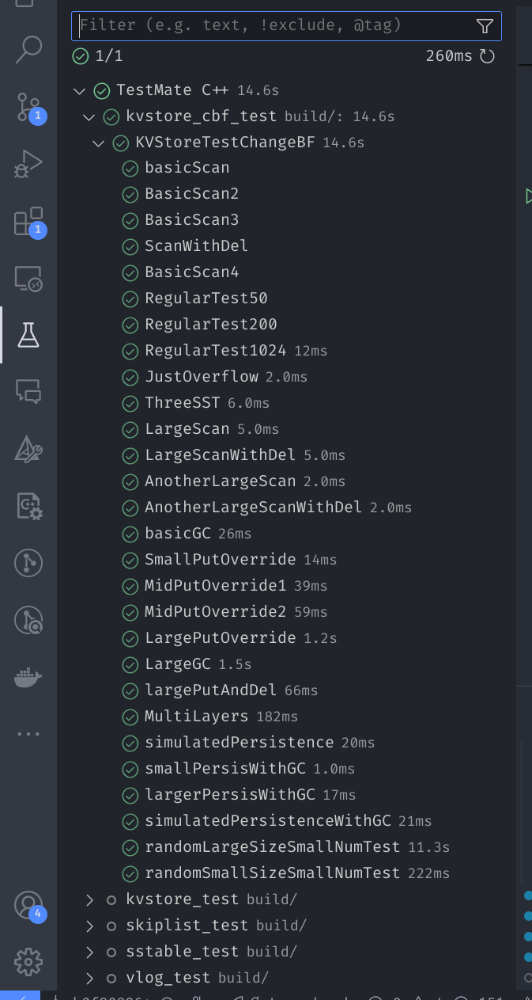
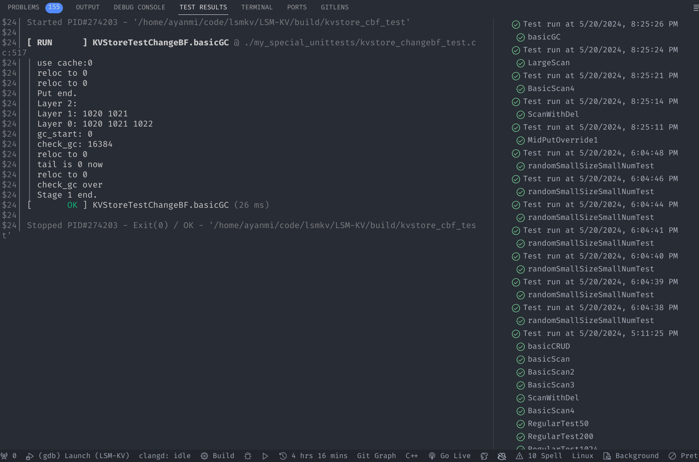

### 测试使用说明

见 `CMakeLists.txt`,需要针对你的文件命名情况改变一些参数(你可能也需要删去对你没有用的构建参数和目标)。

搜索 `google test` 或者询问 AI，以了解 `CMakeLists.txt` 函数里面的语句意思和如何微调。本测试只用了最基本的测试断言和测试夹具。部分测试为助教提供测试的拆分与弱化，便于同学们 debug。
由于每个同学的模块设计和内部 API 实现不同，除了 `kvstore_test.cc` 这个联合测试对应的测试之外，其他的测试文件对应的所有单元测试仅供参考，并不能开箱即用。同时由于 gtest 测试框架的原因，如果采用 makefile 或者其他非 CMake 方式编译的同学需要自己做 `CMakeLists.txt` 的修改以编译项目

编译命令

```
cmake -G "Unix Makefiles" -B build
cd build
make -j8
```

使用 vscode 的同学安装 `c++ testmate` 这个插件之后，就可以直接在侧边栏看到如下图所示的测试，点击运行即可看到耗时和正确情况。也可以直接在内部以 debug 模式调试。可以正常打 Log。





附注：`simulated-persistence` 测试需要自己实现 `reset` 和 `rebuild` 这两个清空和重建缓存的 API
